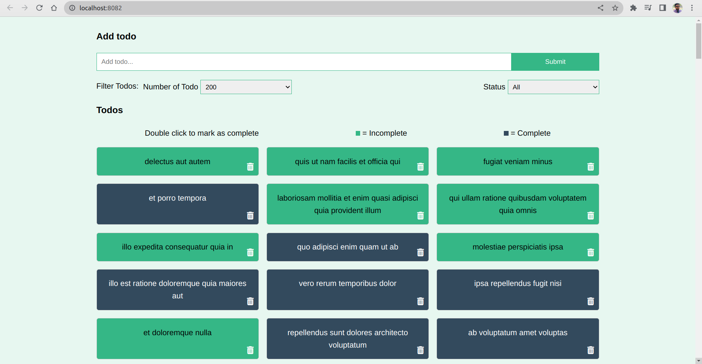
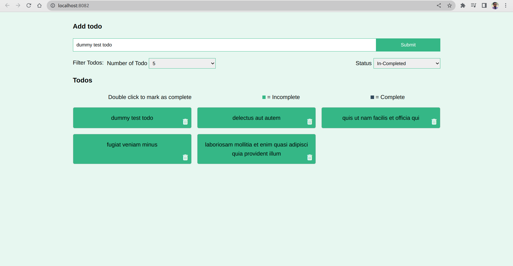

# todo-manager
This application is a **Vuejs (vue/cli) project** where 
Vuex and multiple vue components are used. 
**It can be a great example for beginner.**

Features: 
- single page application with **vuex**
- add fontawesome icon
- can add custom todo
- filter using number of item in page and todo status
- can update status of todo by double clicking

Lets see some screenshot:
    
    
and another screenshot while filtering:

## Project setup
```
npm install
```

### Compiles and hot-reloads for development
```
npm run serve
```

### Compiles and minifies for production
```
npm run build
```

### Lints and fixes files
```
npm run lint
```

### Customize configuration
See [Configuration Reference](https://cli.vuejs.org/config/).
